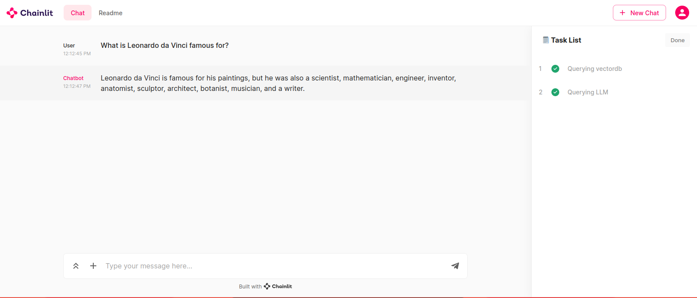

# wikichat

## 🌟 Overview

`wikichat` ingests [Cohere's multilingual Wikipedia embeddings](https://txt.cohere.com/embedding-archives-wikipedia/) into a Chroma vector database and provides a Chainlit web interface for retrieval-augmented-generation against the data using `gpt-4-1106-preview`.

I wanted to explore the idea of maintaining a local copy of Wikipedia, and this seemed like a good entry point. Down the road I might update this code to regularly pull the [full Wikipedia dump](https://dumps.wikimedia.org/) and create the embeddings, instead of relying on Cohere's prebuilt embeddings. I went this route as a proof of concept, and as an excuse to try out [Chainlit](https://docs.chainlit.io/get-started/overview).

## 🛠 Installation

1. **Clone the Repository:**
   ```bash
   git clone https://github.com/deadbits/wikichat.git
   cd wikichat
   ```

2. **Setup Python virtual environment:**
   ```bash
   python3 -m venv venv
   source venv/bin/activate
   ```

3. **Install Dependencies:**
   ```bash
   pip install -r requirements.txt
   ```

## 📖 Usage

**Set Cohere and OpenAI API keys**
```bash
export OPENAI_API_KEY="...."
export COHERE_API_KEY="..."
```

### Ingest Data

* **Dataset:** [Cohere/wikipedia-22-12-simple-embeddings](https://huggingface.co/datasets/Cohere/wikipedia-22-12-simple-embeddings)
* **Rows:** `485,859`
* **Size:** `1.63` GB

Run `ingest.py` to download the Wikipedia embeddings dataset and load into ChromaDB:

```python
python ingest.py
```

The script adds records in batches of 100, but this will still take some time. The batch size could probably be increased.

### Web Interface

To initiate the web interface, run the `chainlit_ui.py` script with the Chainlit library:

```python
chainlit run chainlit_ui.py
```

**Chainlit interface**


